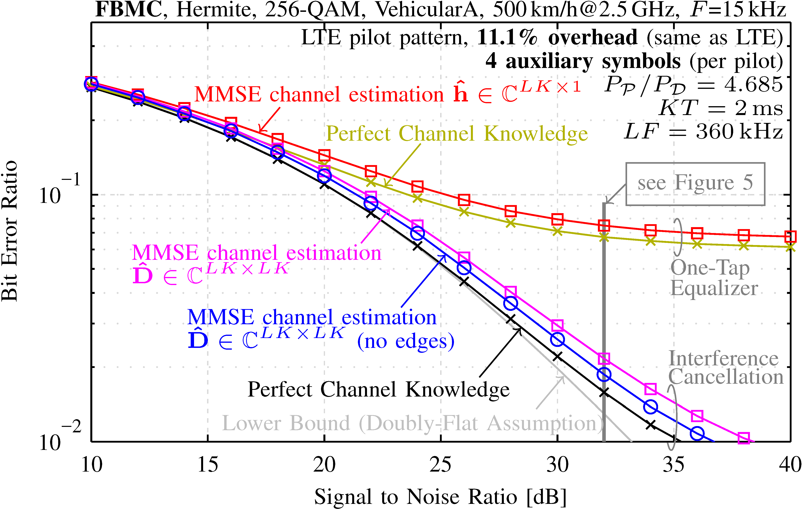
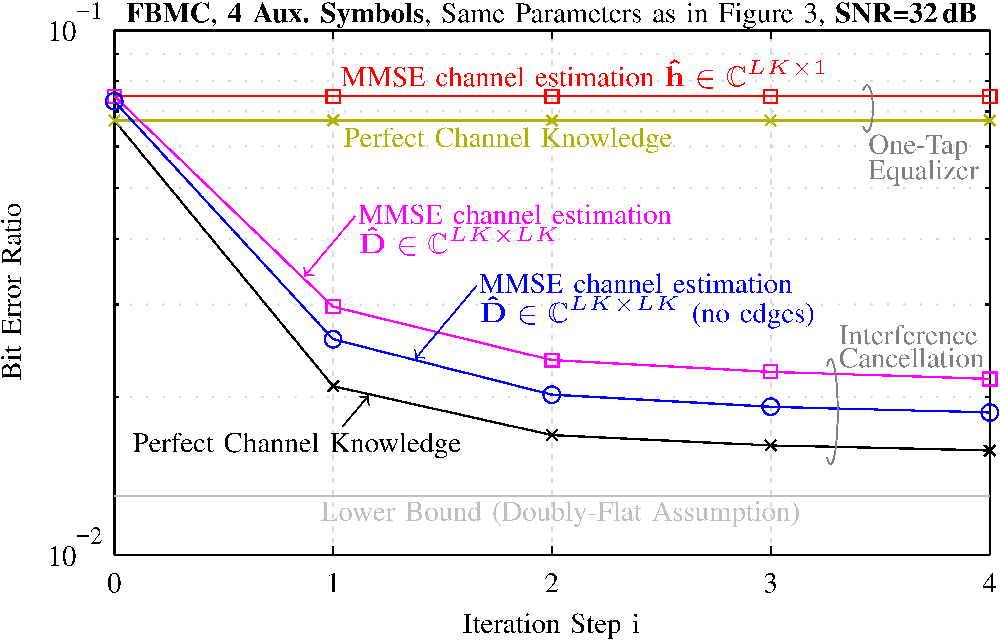

# Channel Estimation

This repository simulates an FBMC and OFDM transmission over a doubly-selective channel, including doubly-selective MMSE channel estimation in combination with interference cancellation.
All figures from R. Nissel et al. [“Doubly-Selective Channel Estimation in
FBMC-OQAM and OFDM Systems”](https://publik.tuwien.ac.at/files/publik_270559.pdf), IEEE VTC Fall, 2018, can be reproduced.

Supported Waveforms:

- OFDM 
- FBMC, channel estimation: auxiliary symbols
- FBMC, channel estimation: data spreading

Note that I use a matrix based system model. This makes the derivation of the correlation matrices relatively easy but also requires a large memory. If one wants to simulate over a higher bandwidth, either the system model must be split into smaller chunks, or the matrices must be explicitly expressed by summations.  

## Requirements
We used Windows 7 (64bit) and Matlab R2013b/2016a, but newer versions (and some older) should also work.

## Basic Properties

### Our doubly-selective channel estimation method performs close to perfect channel knowledge:

### The first iteration step greatly improves the BER, which soon saturates:

## Reproducible Figures

All figure from [“Doubly-Selective Channel Estimation in FBMC-OQAM and OFDM Systems”](https://publik.tuwien.ac.at/files/publik_270559.pdf) can be reproduced. The figure numbers are the same as in the paper.

* **Figure  1**: 
Just an illustration.

* **Figure  2**: 
Please run [`DoublySelectiveChannelEstimation.m`](DoublySelectiveChannelEstimation.m). To truly reproduce Figure 2, the lines 42-46 must be uncommented (increases the simulation time). 

* **Figure  3**: 
Please run [`DoublySelectiveChannelEstimation.m`](DoublySelectiveChannelEstimation.m). To truly reproduce Figure 3, the lines 42-46 must be uncommented (increases the simulation time). 

* **Figure  4**: 
Please run [`DoublySelectiveChannelEstimation.m`](DoublySelectiveChannelEstimation.m). To truly reproduce Figure 4, the lines 42-46 must be uncommented (increases the simulation time). 

* **Figure  5**: 
Please run [`DoublySelectiveChannelEstimation.m`](DoublySelectiveChannelEstimation.m). To truly reproduce Figure 5, the lines 42-46 must be uncommented (increases the simulation time). 

## Additional Explanations for Channel Estimation in FBMC
The Matlab code [`SimpleVersion_DoublyFlat.m`](SimpleVersion_DoublyFlat.m) simulates an FBMC and OFDM transmission over a doubly-flat channel, including channel estimation. In particular, it illustrates the auxiliary symbol method and the data spreading approach, with much less overhead than for the doubly-selective channel estimation method. The script is based on my paper [“On pilot-symbol aided channel estimation in FBMC-OQAM”](https://publik.tuwien.ac.at/files/PubDat_248707.pdf).

## Please Cite Our Paper

    @inproceedings{Nissel2018VTC,
		author    = {R. Nissel and F. Ademaj and M. Rupp},
		booktitle = {IEEE Vehicular Technology Conference (VTC Fall)},
		title     = {Doubly-Selective Channel Estimation in {FBMC-OQAM} and {OFDM} Systems},
		year 	  = {2018},
		pages 	  = {1-5}, 
		month 	  = {Aug},
	}

## References
- R. Nissel, F. Ademaj and M. Rupp, [“Doubly-Selective Channel Estimation in FBMC-OQAM and OFDM Systems”](https://publik.tuwien.ac.at/files/publik_270559.pdf), IEEE Vehicular Technology Conference (VTC Fall), Chicago, August, 2018
- R. Nissel, and M. Rupp, [“On pilot-symbol aided channel estimation in FBMC-OQAM”](https://publik.tuwien.ac.at/files/PubDat_248707.pdf), IEEE International Conference on Acoustics, Speech and Signal Processing (ICASSP), Shanghai, China, March 2016.
- R. Nissel, M. Rupp, and R. Marsalek, [“FBMC-OQAM in Doubly-Selective Channels:
A New Perspective on MMSE Equalization”](https://publik.tuwien.ac.at/files/publik_259771.pdf), IEEE International Workshop on Signal Processing Advances in Wireless Communications (SPAWC), Sapporo, Japan, July 2017.
- R. Nissel, S. Schwarz, and M. Rupp, [“Filter bank multicarrier modulation schemes for future mobile communications”](https://publik.tuwien.ac.at/files/publik_260162.pdf), IEEE Journal on Selected Areas in Communications, vol. 35, no. 8, pp. 1768–1782, 2017.
- R. Nissel, [“Filter bank multicarrier modulation for future wireless systems”](http://publik.tuwien.ac.at/files/publik_265168.pdf), Dissertation, TU Wien, 2017.

